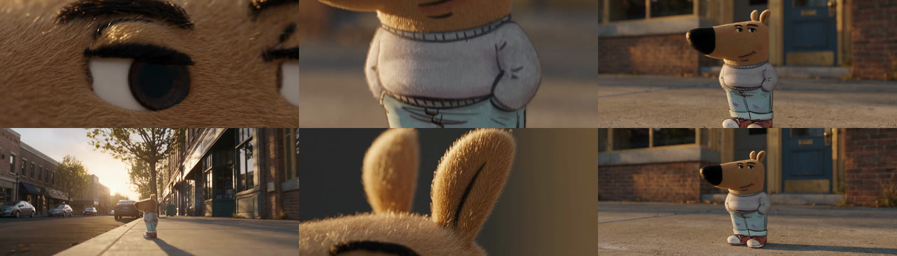

# Meme Scene Explorer

Turn one meme still into a 15-second cinematic film.

The still is the only evidence. The subject stays frozen. Only the camera moves.



Six frames from a real run, in order. Extreme close-up of the defining detail, out to the clothes, out to the subject in the world, wide to the street, back to a texture, then a hard snap to a centered master that matches the original meme framing. The character does not move and is not redrawn in any of them — every change is the camera.

This repo packages [Alex Patrascu (@maxescu)'s method](https://x.com/maxescu/status/2087592524940452149) for [Higgsfield](https://higgsfield.ai) **Seedance 2.5**. Humans run a Python script. Any coding agent that can read a file and run a shell command can run the same script. No vendor-specific APIs.

Seedance has no seed. The same image and prompt will not produce identical pixels. What this repo locks is the **method**: model, flags, prompt shape, and the rule that the original still is never redrawn by another image model.

## Why the subject has to stay frozen

This is the whole trick, so it is worth stating plainly. Video models drift. Give one room to animate a face and it will quietly rebuild that face a little more generically with every second — the meme survives the first shot and is gone by the tenth.

Freezing the subject removes the thing that drifts. All fifteen seconds of change are spent on camera movement, which the model is good at and which cannot alter identity. That is why "only the camera moves" is a hard rule and not a stylistic preference: it is what makes the character in second 15 the same character as in second 1.

`omni_reference` is the other half. It tells Seedance the attached still is *evidence of who this is*, not a first frame to animate away from. Passing the same JPEG as `--start-image` would animate the picture — watermarks, captions, compression and all. That is why it is forbidden here.

## Vocabulary

| Term | Meaning |
|---|---|
| **Seedance 2.5** | The video model this runs on, hosted by Higgsfield. Paid, no seed. |
| **`omni_reference`** | Seedance mode where a reference image supplies *identity*, not a starting frame. The one mode this method uses. |
| **`meme_reference`** | The name the prompt gives your still so later lines can point back at it. |
| **Diegetic sound** | Sound that exists inside the scene — wind, traffic, fabric. No score, no music. |
| **Stage** | One of the fifteen one-second beats. Each names a camera move toward a real detail. |

## Which file do I read?

| You are | Read |
|---|---|
| A person running this yourself | This README |
| A coding agent | [`AGENTS.md`](AGENTS.md) — then [`SKILL.md`](SKILL.md) |
| Changing what gets sent to Seedance | [`references/prompt-contract.md`](references/prompt-contract.md) — the spec |
| Writing your own 15 stages | [`examples/filled-prompt.puppy.txt`](examples/filled-prompt.puppy.txt) — copy the shape, not the content |

## Requirements

- A [Higgsfield](https://higgsfield.ai) account with credits. Seedance 2.5 is paid: one 15s 720p run costs **~97.5 credits** (5s costs 32.5). Check with `higgsfield generate cost seedance_2_5 --duration 15 --resolution 720p`.
- The [Higgsfield CLI](https://github.com/higgsfield-ai/cli)
- Python 3.9+ (standard library only). Commands below use `python3`; on Windows use `python`.
- One meme image (`.jpg`, `.png`, or `.webp`)

Install the CLI. This works on macOS, Linux, and Windows:

```bash
npm install -g @higgsfield/cli
higgsfield auth login
```

On macOS or Linux you can use the shell installer instead:

```bash
curl -fsSL https://raw.githubusercontent.com/higgsfield-ai/cli/main/install.sh | sh
```

`explore.py` prices every run against your balance before it submits, and stops if you cannot cover it.

## Run

```bash
git clone https://github.com/AIEngineerX/meme-scene-explorer.git
cd meme-scene-explorer

python3 scripts/explore.py path/to/meme.jpg --out ~/Videos --world "a dusty farm at golden hour"
```

That fills the bundled 15-stage skeleton with your world. Seedance reads the still and fills the beats.

For a better film, write stages from the actual details in the still. Two worked prompts are bundled to copy the shape from — [`filled-prompt.puppy.txt`](examples/filled-prompt.puppy.txt) and [`filled-prompt.dog.txt`](examples/filled-prompt.dog.txt), the one that produced the frames at the top of this page. Then:

```bash
python3 scripts/explore.py path/to/meme.jpg \
  --prompt-file path/to/your-stages.txt \
  --out ~/Videos
```

| Flag | Default | Meaning |
|---|---|---|
| `--prompt-file` | none — the skeleton is used | Your filled 15-stage prompt. Not valid with `--world`. |
| `--world` | a matching real place | Setting written into the skeleton. Ignored — and rejected — if `--prompt-file` is given. |
| `--out` | current directory | Where the `.mp4` is saved |
| `--duration` | `15` | Seconds. The contract assumes 15. |
| `--aspect` | `21:9` | Closest Higgsfield value to Alexa 2.39:1 |
| `--resolution` | `720p` | `480p` or `720p`. A quality tier, not a line count — at 21:9, `720p` delivers 1470×630. |
| `--wait-timeout` | `20m` | How long to wait for the job |
| `--skip-lint` | off | Send a `--prompt-file` that fails the contract check anyway |
| `--no-download` | off | Print the result URL only |

Your `--prompt-file` is checked against the contract before anything is submitted — exactly 15 `[Stage N]` markers, a closing `<diegetic sound bed>`, and a plausible length. A run costs real credits, so a prompt that is short by three stages should fail on your machine, not on the invoice. `--skip-lint` overrides it.

`--duration`, `--aspect`, and `--resolution` are overrides. The [prompt contract](references/prompt-contract.md) assumes the defaults; changing them changes the method.

Output is never overwritten. A second run on the same still writes `meme_mse-2.mp4`, because Seedance has no seed and the first take cannot be reproduced.

## Use with a coding agent

```bash
python3 scripts/install.py
```

That links this folder into every skills directory already on the machine (`~/.agents/skills`, `~/.claude/skills`, `~/.codex/skills`, `~/.cursor/skills`, `~/.gemini/skills`, `~/.grok/skills`, and others if present). It is safe to re-run, including after you move the clone.

A target that already holds a *different* `meme-scene-explorer` directory is reported and left alone. Pass `--force` to replace it — that deletes what is there.

To vendor it into another project:

```bash
python3 scripts/install.py --project /path/to/your/app
```

Point `--project` at the app you want to vendor into, not at this clone.

Then attach a still and say **explore this meme**. Agents should follow `AGENTS.md` and generate only through `scripts/explore.py`.

## How it works

1. The meme still is the only image reference (`omni_reference`).
2. The prompt restages that same subject in one real place.
3. Fifteen one-second stages: close-up of the defining detail → the subject → the world → snap back to the original framing.
4. Diegetic sound only. No music. No original JPEG, captions, or UI.

```text
higgsfield generate create seedance_2_5
  --mode omni_reference
  --image-references <meme.jpg>
  --duration 15
  --aspect_ratio 21:9
  --resolution 720p
  --generate_audio true
```

Full contract: [`references/prompt-contract.md`](references/prompt-contract.md).

## Verified

Every number on this page comes from real completed runs on Seedance 2.5, not from estimates:

| Claim | How it was checked |
|---|---|
| 15 one-second stages | Submitted prompt carried exactly 15 `[Stage` markers |
| 15-second film | Delivered file is 15.04s at 24fps |
| 21:9 | Delivered file is 1470×630 — 2.333:1, the closest enum to Alexa's 2.39:1 |
| Diegetic audio | Delivered file carries an AAC stereo track |
| ~97.5 credits per run | Balance moved 109 → 11.5 across one run |
| Result is an `.mp4` | Result URLs end in `.mp4`; the frames above were pulled from one |
| Identity holds for 15s | See the contact sheet — same character in frame 1 and frame 6 |

The locked flags are checked against `higgsfield model get seedance_2_5` by the test suite, so a change on Higgsfield's side fails CI rather than a paid job.

Verified against Higgsfield CLI **1.1.20 and 1.1.23** (latest as of 2026-08-13): identical `seedance_2_5` parameters, same price, and the prompt still arrives over stdin. Install the latest.

**Why a CLI and not an MCP server:** there is no official Higgsfield MCP server as of 2026-08-13. `@higgsfield/cli` is the actively maintained surface — the third-party `higgsfield-mcp` package is several months behind it. Higgsfield also publish `@higgsfield/client` (a Node SDK) and `@higgsfield/cloud-cli` (API-key auth, aimed at headless agents); if you need to run this without an interactive `auth login`, that is where to look.

## What's in this repo

```text
AGENTS.md                         instructions for any coding agent
SKILL.md                          skill entry (name + when to load)
LICENSE                           MIT
scripts/explore.py                generate a video
scripts/install.py                install the skill for local agents
references/prompt-contract.md     locked flags and prompt rules
examples/skeleton.txt             default prompt (used when you pass no --prompt-file)
examples/filled-prompt.puppy.txt  worked 15-stage prompt — held subject, farmyard
examples/filled-prompt.dog.txt    worked 15-stage prompt — standing subject, street
examples/example-frames.jpg       six frames from a real run
agents/openai.yaml                Codex discovery stub
tests/                            unittest suite
```

## Tests

```bash
python3 -m unittest discover -s tests
```

No mocks. The suite drives both scripts for real, and — when the Higgsfield CLI is installed and logged in — validates the locked param set against the live API via `generate cost`, which creates no job and spends no credits. Those two tests skip cleanly when the CLI is absent.

## Troubleshooting

Every message below is one the script actually prints. It stops before spending credits in all of these cases except the last two.

| What you see | What to do |
|---|---|
| `higgsfield CLI not found` | `npm install -g @higgsfield/cli` — works on Windows too, unlike the shell installer |
| `not logged in. Run: higgsfield auth login` | Log in. The session does expire. |
| `higgsfield account status failed (exit N)` | Not an auth problem — the CLI's own output follows the colon. Usually network or a Higgsfield outage. |
| `this run needs about 97.5 credits and the account has 11.5` | Top up. One 15s 720p run costs ~97.5, so a starter plan covers one. |
| `... does not match the prompt contract` | Your `--prompt-file` is missing stages or the closing sound bed. Fix it, or `--skip-lint`. |
| `prompt file still contains the {world} placeholder` | You passed the skeleton as `--prompt-file`. Either fill it in, or drop `--prompt-file` and use `--world`. |
| `--world only fills the built-in skeleton` | Pick one: a written prompt file, or the skeleton plus a world. |
| `image not found` | Give a real path to a local `.jpg`, `.png`, or `.webp`. |
| `python: command not found` | Use `python3` on macOS and Linux. |
| `job finished but printed no video URL` | Credits are already spent. `higgsfield generate list` shows the job and its URL. |
| Nothing printed for minutes | Normal. A 15s job takes a few minutes; the CLI's progress is relayed live. |

## What not to do

- Do not redraw the subject in another image or video model, then animate those stills.
- Do not pass the original JPEG as `--start-image`. That keeps the upload, captions, and compression.
- Do not send a generic list of camera moves. Name details that exist on *this* still.
- If Higgsfield is unavailable, stop. Do not fake the film.

## Credit

Method: [Alex Patrascu (@maxescu)](https://x.com/maxescu/status/2087592524940452149). Runtime: Higgsfield Seedance 2.5.

## License

MIT. See [LICENSE](LICENSE).
